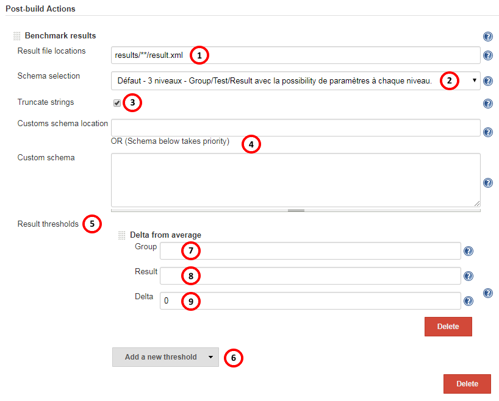
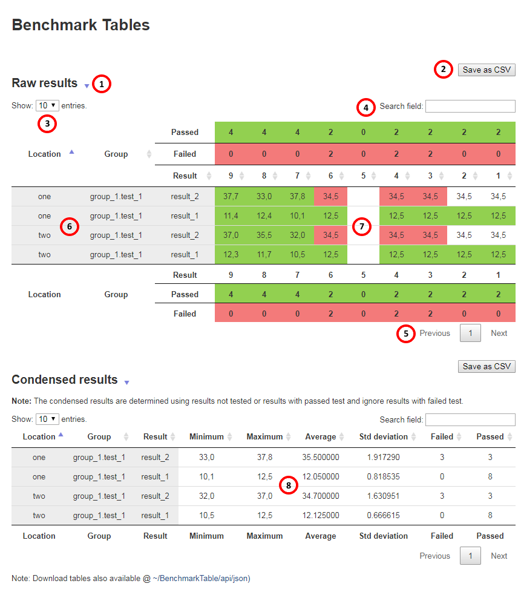
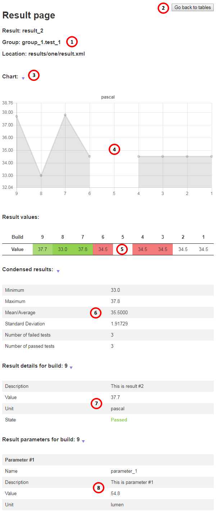

COPYRIGHT &copy; 2017 AUTODESK INC.

# How to use the 'Benchmark Plug-in'

This plug-in is designed for the CI/CD platform, [**Jenkins**](https://jenkins.io/). This plug-in adds a post-build capability to benchmark between builds both boolean and numerical results through tables and graphs. The plug-in has also a mechanism of thresholds over numerical values to control a build success or failure.

## Plug-in workflow

- Create a job,  
- Adding the post-build event called **Benchmark results**,  

**Note:** The plug-in supports all types of jobs.

### Default  

In default mode, the plug-in gathers any result files generated by the ['jUnit Plug-in'](https://wiki.jenkins.io/display/JENKINS/JUnit+Plugin) or ['xUnit Plug-in'](https://wiki.jenkins.io/display/JENKINS/xUnit+Plugin).

- Place the 'Benchmark Plug-in' after the ['jUnit Plug-in'](https://wiki.jenkins.io/display/JENKINS/JUnit+Plugin) or  the ['xUnit Plug-in'](https://wiki.jenkins.io/display/JENKINS/xUnit+Plugin) post-build event,  
- Run a build.  

### Complete  
- Configure the plug-in configurations:
    - See below 'Plug-in configuration options' to fill the available options,  
    - See below 'Rules to build a schema' to build a custom schema.  
- Run a build,  

### Workflow conclusion
- If the build was successful, the following icon & text should appear on the job main page:  

 **Benchmark Tables**  

- Click on the link will load the 'Benchmark Tables',  
    -  See below 'Plug-in table page' for a description of content.  
- Click on any of the table rows to access details about the selected result,  
    - See below 'Plug-in result page' for a description of content.  

**WARNING:** It is strongly suggested to keep the number of builds limited using the 'Discard Old Builds' option.  
**WARNING:** If any data is missing, please check that the format of the result file is compatible with the selected schema.  

## Plug-in configuration options

  

1. File search pattern to locate the result files relative to the workspace:  
    - Use comma ',' or semi-colon ';' as separator,  
    - Use the star character '*' to add wildcards,  
    - Create lists of locations inside "*.list" files.  
     **If missing:** The plugin will try to fetch any data generated by either the 'JUnit Plugin' or the 'xUnit Plugin'.
2. Schema selector (Dropdown menu)  
    - Listed schema(s) are stored [HERE](../src/main/resources/schemas),  
    - Use **4** to insert 'Custom schema'.  
3. Truncating strings affects loading speed and helps prevent RAM overloading.  
4. A text field will appear after clicking this button to insert a custom schema.  
    - See below for rules to build a custom schema.  
5. Additional result thresholds can be added at configuration time to determine result success or failure.  
6. Five types of optional thresholds are available:  
    - Absolute,  
    - Delta from average,  
    - Delta from previous,  
    - Percentage from average, 
    - Percentage from previous.  
7. Group name [can be omitted],  
8. Result name [can be omitted],  
9. The threshold parameters depend on the type of threshold:  
    - Maximum must above minimum if any specified,  
    - Delta must be above zero,  
    - Percentage is a value between 0 and 100.  

## Making a custom schema

Click [HERE](./BUILD_CUSTOM_SCHEMA.md) to access instructions.  

JSON example:  
- [Simple JSON schema](./EXAMPLE_SCHEMA_JSON_SIMPLE.md)  
- [Standard JSON schema](./EXAMPLE_SCHEMA_JSON_DEFAULT.md)  

XML example:  
- [Simple XML schema](./EXAMPLE_SCHEMA_XML_SIMPLE.md)  
- [Standard XML schema](./EXAMPLE_SCHEMA_XML_DEFAULT.md)  

## Plug-in table page  

  

1. Clicking on the title controls the display of the table underneath.  
2. Click to save the content of the table underneath to a CSV file.  
    - Two files for the raw table (result values & states with "passed"/"failed"),  
    - One file for the condensed table.  
3. Control the number of table entries, synchronized with the two tables.  
4. Search field, also synchronized with the two tables.  
5. Pagination, also synchronized with the two tables.  
6. Row headers, one per result.  
    - The 'Location' and 'Group' columns will only appear if they are necessary,  
    - The 'Location' represent only the delta between file paths,  
    - The full path can be found in the result page (see below).  
7. Every result values for every build.  
    - The cell coloring overlay represents the state of validation test(s) over the result,  
        - **blank** if no validation test was associated,  
        - **green** when all tests passed,  
        - **red** when at least one test failed.  
    - Clicking on a row will open the associated result page.
8. Condensed results.  
    - All result have a count of failed and passed for the active number of saved builds,  
    - Numeral results have in addition minimum, maximum, average & std deviation,  
    - Clicking on a row will open the associated result page.  

## Plug-in result page  

  

1. Result name, group and file path.  
2. Button to go back to the page with tables.  
3. Clicking on the title controls the display of the content underneath.  
4. Graph for numeral results only.  
5. List of result values for all active saved builds.  
    - Clicking on a column will display underneath the associated result information for the selected build.  
6. Condensed values for this result.  
7. Detailed information for the result at the selected build [default = last].  
8. Parameters associated to the result at the selected build [default = last].  